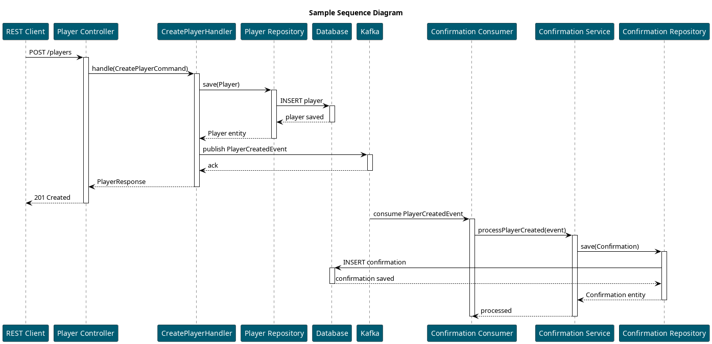

= Prototipo de Arquetipo para Spring Boot con Clean Architecture y Spring Cloud Stream Vertical Slices

== Introducción

Este proyecto es un prototipo que muestra una aplicación Java Spring Boot diseñada siguiendo principios de Clean Architecture (hexagonal / ports & adapters) y usando Spring Cloud Stream para integración con Kafka en un enfoque "vertical slices" (cada módulo contiene sus capas: domain, application, interfaces, infrastructure).

Se pretende ser un punto de partida para microservicios que publican y consumen eventos, JPA para la persistencia, CQRS para la integración de commands y queries.

== Estructura del proyecto

En este proyecto de ejemplo tendremos dos módulos verticales principales: _player_ y _confirmation_, además de un módulo _shared_ para código común.

El módulo _player_ define la lógica relacionada con la gestión de jugadores (creación, actualización, consulta) y publica eventos cuando se crean nuevos jugadores.

El módulo _confirmation_ consume eventos de creación de jugadores y maneja la lógica relacionada con la confirmación de jugadores (por ejemplo, enviar emails de confirmación).

----
src/
 ├── org/labcabrera/sample/archetype
 │   ├── player
 │   ├── confirmation
 │   └── shared
----

TIP: El contenido del módulo _shared_ podría extraerse a módulos externos autoconfigurables equivalentes a los starters de Spring Boot para compartir entre proyectos.

El flujo general es:



Dentro de cada módulo vertical, seguimos la estructura típica de Clean Architecture:

----
module/
 ├── domain
 ├── application
 ├── infrastructure
 └── interfaces
----

- *domain*: entidades de dominio y lógica de negocio pura.
- *application*: casos de uso y servicios que orquestan la lógica de negocio. En estos se encuentran los handlers CQRS, servicios de aplicación y puertos (interfaces) hacia infraestructuras externas.
- *infrastructure*: adaptadores hacia infraestructuras externas (JPA, Kafka, mappers).
- *interfaces*: adaptadores de entrada (controladores HTTP, consumidores/productores de Spring Cloud Stream).

TIP: La configuración que se encuentra en `src/main/resources/` podría resolverse externamente a través de un servidor de configuración, por ejemplo Spring Cloud Config Server.

== Tecnologías utilizadas

- Spring Boot 3.x (Java 21)
- Spring Cloud Stream + Kafka binder
- Spring Data JPA + Hibernate
- Jackson
- MapStruct (recomendado, no obligatorio) o ObjectMapper para conversiones
- RSQL parser para filtros en endpoints REST
- Micrometer / Actuator
- Testcontainers (recomendado para pruebas de integración con Kafka)

== Cómo compilar y ejecutar

Compilar:

```bash
./gradlew clean build
```

Ejecutar en local (con Kafka accesible en `localhost:9092` o cambiando la variable):

```bash
KAFKA_BROKERS=localhost:9092 ./gradlew bootRun
```

Notas:
- La configuración de `application-cloud-stream.yaml` define las funciones y bindings. Cambia `spring.cloud.stream.kafka.binder.brokers` o usa la variable de entorno `KAFKA_BROKERS` si la personalizas.
- Para pruebas locales aisladas, usa Testcontainers (ver sección pruebas).

== Transaccionalidad y persistencia (recomendaciones)

Patrones y recomendaciones observadas en este arquetipo:

- Límite de transacción en la capa de aplicación (services): Anotar los métodos que orquestan persistencia y publicación de eventos con `@Transactional`.
- Repositorios / adapters deben exponer operaciones atómicas simples (save, update) y evitar decidir transacciones por sí mismos.
- Para evitar inconsistencias DB → Kafka, considerar:
	- Outbox pattern (persistir evento en tabla outbox en la misma transacción y luego publicar desde un proceso separado), o
	- Usar TransactionSynchronizationManager / TransactionSynchronization para publicar eventos después del commit si el binder/producer lo permite.
- Evitar crear instancias Entity (nuevas) con IDs que ya están gestionadas por la sesión — para updates, obtener la entidad gestionada (find) y aplicar cambios sobre ella.

Ejemplo breve:

```java
@Service
public class CreatePlayerService {
	@Transactional
	public Player createPlayer(...) {
		// validar y persistir mediante el puerto repository
		// preparar evento y publicarlo AFTER COMMIT o mediante outbox
	}
}
```

== Spring Cloud Stream y Kafka

- `src/main/resources/application-cloud-stream.yaml` contiene la definición de la función usada por Spring Cloud Stream:
	- `spring.cloud.stream.function.definition` debe coincidir exactamente con el nombre del bean `@Bean` que devuelve `Consumer/Function/Supplier`.
	- Para cada binding (`<function>-in-0`, `<function>-out-0`) configurar `destination`, `group` y `contentType`.
- Variables a ajustar en entornos:
	- `spring.cloud.stream.kafka.binder.brokers` o `KAFKA_BROKERS`.
	- `spring.cloud.stream.bindings.<name>.consumer.startOffset` (ej. earliest) para desarrollo.

== Manejo de errores en Consumers

- Implementar validación de payloads antes de procesar.
- Configurar DLQ y retry (reintentos) en binder si se requiere garantia de entrega y manejo de errores.

== Pruebas

- Unit tests: usar `spring-boot-starter-test` y Mockito para servicios y handlers.
- Integration tests:
	- Usar Testcontainers Kafka para levantar un broker y probar el flujo E2E de publicación/consumo.
	- Usar `@DataJpaTest` para repositorios y `@SpringBootTest` con Testcontainers para orquestación completa.

Ejemplo (esqueleto) con Testcontainers Kafka:

```java
@Testcontainers
@SpringBootTest
class KafkaIntegrationTest {
	@Container
	static KafkaContainer kafka = new KafkaContainer("confluentinc/cp-kafka:7.4.1");

	@BeforeAll
	static void setup() {
		System.setProperty("KAFKA_BROKERS", kafka.getBootstrapServers());
	}
	// tests...
}
```

== Observabilidad

- Actuator + Prometheus (micrometer) están incluidos en el proyecto. Ver endpoints en `/actuator`.
- Logs: `logback-spring.xml` está preconfigurado; ajustar niveles desde `application.yaml` para ver binder/kafka y cloud stream en `DEBUG` si es necesario.

== Buenas prácticas y tareas recomendadas

- Mapeo: usar MapStruct para conversiones entre domain/entity/DTO en lugar de `ObjectMapper` cuando sea posible.
- Validación: usar Bean Validation (`jakarta.validation`) en DTO/commands.
- Events: definir esquemas (JSON Schema / Avro) para eventos y versionarlos.
- Manejo transaccional: usar outbox si necesitas garantía estricta DB->Kafka.
- Añadir tests de integración usando Testcontainers para Kafka y la BD.

== Notas sobre la implementación (puntos detectados)

=== Spring Cloud Stream

Se ha utilizado Spring Cloud Stream con Kafka binder para la integración basada en eventos. Los consumidores y productores están definidos como beans `@Bean` de tipo `Consumer` o `Function`.

=== RSQL

Se ha utilizado la libreria `rsql-parser` para parsear filtros RSQL en endpoints REST. Esto permite construir queries dinámicas basadas en parámetros de consulta.
Se ha añadido el operador `=re=` para búsquedas "contiene" (like %value%) en strings.

=== Validation

Se ha integrado Bean Validation (`jakarta.validation`) para validar DTOs y comandos entrantes. Usar anotaciones como `@NotNull`, `@Size`, etc. en las clases de request/command.

=== CQRS

Se ha adoptado un enfoque CQRS básico en la capa de aplicación, separando comandos (modificaciones de estado) y consultas (lecturas). Cada comando tiene su propio handler que encapsula la lógica de negocio asociada.
En lugar de utilizar una implementación compleja de bus de comandos, se ha optado por un enfoque simple basado en servicios Spring gestionados por el contenedor de IoC.

=== Springdoc

En este caso el enfoque REST es _code-first_, por lo que se ha utilizado anotaciones en los controladores para definir los endpoints y sus contratos.

Podemos consultar la API localmente en `http://localhost:8080/swagger-ui.html`

=== Mapeo de campos

En este ejemplo se ha utilizado Jackson `ObjectMapper` para conversiones entre entidades JPA, objetos de dominio y DTOs. Sin embargo, se recomienda usar MapStruct para un mapeo más eficiente y mantenible en proyectos reales.

== Referencias

- [Spring Boot](https://spring.io/projects/spring-boot)
- [Spring Cloud Stream](https://spring.io/projects/spring-cloud-stream)
- [Clean Architecture](https://8thlight.com/blog/uncle-bob/2012/08/13/the-clean-architecture.html)
- [Testcontainers](https://www.testcontainers.org/)
- [MapStruct](https://mapstruct.org/)
- [RSQL Parser](https://github.com/jirutka/rsql-parser)
