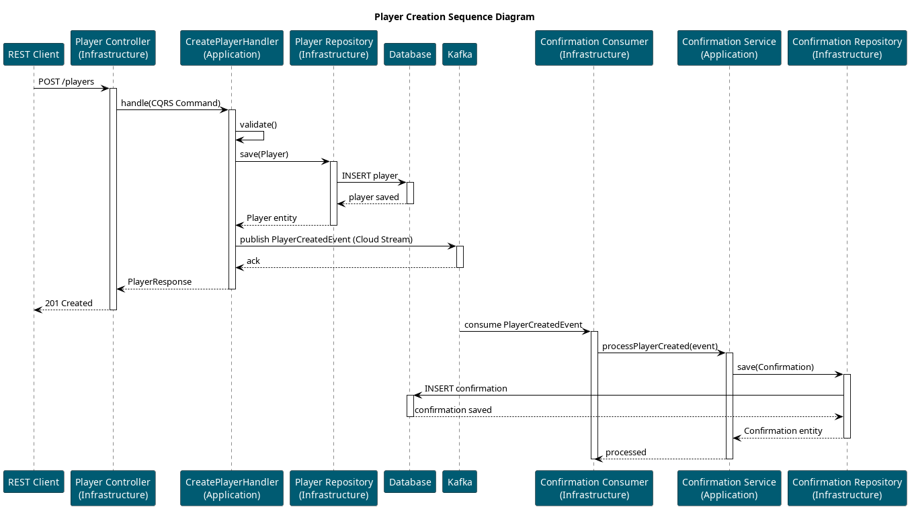

= Prototipo de Arquetipo para Spring Boot con Clean Architecture y Spring Cloud Stream usando Vertical Slices

== Introducción

Este proyecto es un prototipo que muestra una aplicación Java Spring Boot diseñada siguiendo principios de Clean Architecture (hexagonal / ports & adapters) y usando Spring Cloud Stream para integración con Kafka en un enfoque "vertical slices" (cada módulo contiene sus capas: domain, application, interfaces, infrastructure).

Se pretende ser un punto de partida para microservicios que publican y consumen eventos, JPA para la persistencia, CQRS para la integración de commands y queries.

También incluye la configuración básica para seguridad con OAuth2 Resource Server (JWT) y Keycloak como proveedor de identidad.

== Tecnologías utilizadas

- Spring Boot 3.x (Java 21)
- Spring Cloud Stream + Kafka binder
- Spring Data JPA + Hibernate
- Jackson
- MapStruct
- Springdoc OpenAPI para documentación de la API REST
- RSQL parser para filtros en endpoints REST
- Micrometer / Actuator

== Estructura del proyecto

En este proyecto de ejemplo tendremos dos módulos verticales principales: _casefolder_ y _casestep_, además de un módulo _shared_ para código común.

El módulo _casefolder_ define la lógica de un expediente, en este ejemplo un CRUD básico y la publicación de eventos.

El módulo _casestep_ define la lógica de un trámite. Un expediente podrá tener N ttrámites asociados, y este módulo consume eventos de creación de expedientes para iniciar los trámites correspondientes.

----
src/
 ├── org/labcabrera/sample/archetype
 │   ├── casefolder
 │   ├── casestep
 │   └── shared
----

TIP: El contenido del módulo _shared_ podría extraerse a módulos externos autoconfigurables equivalentes a los starters de Spring Boot para compartir entre proyectos.

El flujo general es:



Dentro de cada módulo vertical, seguimos la estructura típica de Clean Architecture:

----
module/
 ├── domain
 ├── application
 ├── infrastructure
 └── interfaces
----

- *domain*: entidades de dominio y lógica de negocio pura.
- *application*: casos de uso y servicios que orquestan la lógica de negocio. En estos se encuentran los handlers CQRS, servicios de aplicación y puertos (interfaces) hacia infraestructuras externas.
- *infrastructure*: adaptadores hacia infraestructuras externas (JPA, Kafka, mappers).
- *interfaces*: adaptadores de entrada (controladores HTTP, consumidores/productores de Spring Cloud Stream).

TIP: La configuración que se encuentra en `src/main/resources/` podría resolverse externamente a través de un servidor de configuración, por ejemplo Spring Cloud Config Server.

== Cómo compilar y ejecutar

Compilar:

```bash
./gradlew clean build
```

Después levantaremos Kafka localmente a través de docker compose ejecutando:

----
docker-compose -f ../docker/docker-compose.yaml -d
----

Y levantaremos la aplicación a través del comando:

----
java -jar build/libs/*.jar
----

== Notas sobre la implementación

=== Spring Cloud Stream

Se ha utilizado Spring Cloud Stream con Kafka binder para la integración basada en eventos. Los consumidores y productores están definidos como beans `@Bean` de tipo `Consumer` o `Function`.

Dentro de la configuración realizamos el mapeo de los bindings a destinos Kafka específicos y grupos de consumidores:

[source,yaml]
----
spring:
  cloud:
    function:
      definition: processCaseFolderCreation
    stream:
      bindings:
        # input bindings
        processCaseFolderCreation-in-0:
          destination: sample.case-folders.creation.v1
          group: case-folders-svc
          contentType: application/json
        # output bindings
        caseFolderCreated-out-0:
          destination: sample.case-folders.created.v1
          contentType: application/json
        caseFolderUpdated-out-0:
          destination: sample.case-folders.updated.v1
          contentType: application/json
        caseFolderDeleted-out-0:
          destination: sample.case-folders.deleted.v1
          contentType: application/json
----

Esta configuración realiza el binding automático de los consumidores y productores a los topics Kafka correspondientes por ejemplo en nuestro controlador de Kafka:

[source,java]
----
@Configuration
@RequiredArgsConstructor
public class KafkaCaseFolderController {

    private final CommandBus commandBus;

    @Bean
    public Consumer<CreateCaseFolderCommand> processCaseFolderCreation() {
        return command -> commandBus.dispatch(command);
    }
}
----

TIP: Usando Spring Cloud Stream evitamos que nuestro código tenga dependencias directas con la API de Kafka de modo que puede ser fácilmente adaptado a otros sistemas de mensajería compatibles con Spring Cloud Stream como por ejemplo RabbitMQ, AWS SQS, etc.

=== Seguridad

==== OAuth2 Resource Server

Se ha configurado la aplicación como un OAuth2 Resource Server que valida tokens JWT emitidos por un proveedor de identidad (IdP) como Keycloak usando la librería _spring-boot-starter-oauth2-resource-server_.

De este modo la aplicación recibe un token JWT en las peticiones HTTP y lo valida para autorizar el acceso a los endpoints protegidos. Para la validación de la firma del token se utiliza el almacén JWK del IAM a través de la configuración definida en _application-security.yaml_:

[source,yaml]
----
spring:
  security:
    oauth2:
      resourceserver:
        jwt:
          jwk-set-uri: ${IAM_JWK_URI:http://localhost:8090/realms/sample/protocol/openid-connect/certs}
          issuer-uri: ${IAM_ISSUER_URI:http://localhost:8090/auth/realms/sample}
----

==== Restricciones de acceso

En la capa de aplicación se ha definido la interface _Guard_ encargada de verificar las restricciones de acceso a nivel de entidad de dominio:

[source,java]
----
public interface Guard<T> {
    void checkRead(T domain, AuthenticatedUser user);
    void checkWrite(T domain, AuthenticatedUser user);
    void checkCreate(AuthenticatedUser user);
}
----

Cada entidad de dominio puede tener su propia implementación de _Guard_ que será invocada desde los servicios de aplicación para verificar si el usuario autenticado tiene permisos para realizar la operación solicitada.
En este ejemplo, la implementación de _Guard_ para la entidad _CaseFolder_ verifica a nivel de los roles obtenidos del IAM y en los casos de no ser administrador de que el campo _owner_ coincida con el usuario autenticado. En otros escenarios podremos implementar lógicas más complejas según las necesidades de seguridad de la aplicación.

==== Filtro en consultas RSQL

Dentro de la implementación del repositorio JPA para la entidad _CaseFolder_ se ha añadido un filtro de seguridad en las consultas RSQL para limitar los resultados según los permisos del usuario autenticado:

[source,java]
----
    @Override
    public Page<CaseFolder> findByRsql(String rsql, Pageable pageable, AuthenticatedUser user) {
        Specification<CaseFolderEntity> authSpec = (root, query, cb) -> {
            if (!user.hasRole(CaseFolderGuard.ROLE_CASE_FOLDER_MANAGEMENT)) {
                return cb.equal(root.get("owner"), user.username());
            }
            return cb.conjunction();
        };
        if (StringUtils.isBlank(rsql)) {
            var page = jpaRepository.findAll(authSpec, pageable);
            return page.map(entity -> mapper.toDomain(entity));
        }
        try {
            Node rootNode = rsqlParser.parse(rsql);
            Specification<CaseFolderEntity> spec = rootNode.accept(new CustomRsqlVisitor<CaseFolderEntity>());
            Specification<CaseFolderEntity> finalSpec = (spec == null) ? authSpec : spec.and(authSpec);
            var page = jpaRepository.findAll(finalSpec, pageable);
            return page.map(entity -> mapper.toDomain(entity));
        }
        catch (Exception ex) {
            throw new BadRequestException("rsql.msg.err.parse", ex, rsql);
        }
    }
----

=== RSQL

Se ha utilizado la libreria `rsql-parser` para parsear filtros RSQL en endpoints REST. Esto permite construir queries dinámicas basadas en parámetros de consulta.
Se ha añadido el operador `=re=` para búsquedas "contiene" (like %value%) en strings.

=== CQRS

Se ha adoptado un enfoque CQRS básico en la capa de aplicación, separando comandos (modificaciones de estado) y consultas (lecturas). Cada comando tiene su propio handler que encapsula la lógica de negocio asociada.
En lugar de utilizar una implementación compleja de bus de comandos, se ha optado por un enfoque simple basado en servicios Spring gestionados por el contenedor de IoC.

=== Springdoc

En este caso el enfoque REST es _code-first_, por lo que se ha utilizado anotaciones en los controladores para definir los endpoints y sus contratos.

Podemos consultar la API localmente en `http://localhost:8080/swagger-ui.html`

Las anotaciones se han definido en una interface _{controller}Definition_ que será implementada por nuestro controlador. De este modo separamos la definición del contrato de la implementación.

Hemos añadido también una configuración personalizada de OpenAPI para definir la seguridad OAuth2 en la documentación para usar tanto un Bearer token como el flujo Authorization Code añadiendo en la configuracion de OpenAPI lo siguiente:

[source,java]
----
		components.addSecuritySchemes(("oidc"), new SecurityScheme()
			.type(SecurityScheme.Type.OAUTH2)
			.description("OAuth2 con OIDC contra IAM")
			.flows(new OAuthFlows()
				.authorizationCode(new OAuthFlow()
					.authorizationUrl(authorizationUrl)
					.tokenUrl(tokenUrl)
					.scopes(new Scopes()
						.addString("openid", "OpenID scope")
						.addString("profile", "User profile scope")
						.addString("api", "API access scope")))));
----

=== Mapeo de campos

Para los mapeos de nuestro objeto de dominio con las entidades JPA y los DTOs de nuestra capa de exposición REST utilizamos MapStruct. Este mapeador genera código en tiempo de compilación para realizar las conversiones de manera eficiente.

Para ello, primeramente definimos en el fichero gradle la configuración necesaria para que MapStruct genere el código:

[source]
----
tasks.withType(JavaCompile).configureEach {
  options.annotationProcessorGeneratedSourcesDirectory = file("$buildDir/generated/sources/annotations")
  options.compilerArgs += ["-Amapstruct.defaultComponentModel=spring"]
}
----

Y después definimos los mapeadores como interfaces anotadas con `@Mapper`:

[source,java]
----
@Mapper
public interface CaseFolderMapper {
    CaseFolder toDomainEntity(CreateCaseFolderCommand command);
    CaseFolderDTO toDTO(CaseFolder entity);
}
----

=== Validation

Este prototipo integra Bean Validation (`jakarta.validation`) para validar tanto nuestros objetos de dominio como los DTOs de nuestra capa de exposición REST.

En nuestros servicios podremos inyectar un validador y utilizarlo para validar las entidades antes de persistirlas o procesarlas:

[source,java]
----
public class CreateCaseFolderService {

    public CaseFolder createCaseFolder(...) {
        var caseFolder = ...
        Set<ConstraintViolation<CaseFolder>> violations = validator.validate(caseFolder);
        if (!violations.isEmpty()) {
            throw new ConstraintViolationException("case-folder.msg.err.validation-error", violations);
        }
        return caseFolderRepository.save(caseFolder);
    }

}
----

En nuestra capa de exposición REST, podemos utilizar la anotación `@Validated` en los controladores para validar automáticamente los DTOs entrantes:

[source,java]
----
@Override
    public ResponseEntity<CaseFolderDto> create(@RequestBody @Validated CreateCaseFolderRequest request) {
        var command = new CreateCaseFolderCommand(
            request.name(),
            request.firstSurname(),
            request.lastSurname(),
            request.idCard().type(),
            request.idCard().number());
        CaseFolder caseFolder = commandBus.dispatch(command);
        var playerDto = mapper.toDto(caseFolder);
        return ResponseEntity.status(201).body(playerDto);
    }
----

=== Gestión de errores

Los errores de la aplicación se manejan extendiendo de _DomainException_.

En la capa de infraestructura REST se ha agregado un _@RestControllerAdvice_ que se encarga de capturar las excepciones lanzadas por los controladores y devolver respuestas HTTP adecuadas con códigos de estado y mensajes de error.

=== I18n

Los mensajes de error y validación se han externalizado en archivos de propiedades para facilitar la internacionalización (i18n). Actualmente solo está el archivo `messages.properties` en inglés, pero se pueden agregar más archivos para otros idiomas.

El manejo de mensajes de realiza a través de la interfaz Spring MessageSource que permite cargar los mensajes según la configuración regional del cliente.

A través de la propiedad HTTP _Accept-Language_ se puede especificar el idioma preferido para las respuestas.

== Observabilidad

- Actuator + Prometheus (micrometer) están incluidos en el proyecto. Ver endpoints en `/actuator`.
- Logs: `logback-spring.xml` está preconfigurado; ajustar niveles desde `application.yaml` para ver binder/kafka y cloud stream en `DEBUG` si es necesario.

== Referencias

- [Spring Boot](https://spring.io/projects/spring-boot)
- [Spring Cloud Stream](https://spring.io/projects/spring-cloud-stream)
- [Clean Architecture](https://8thlight.com/blog/uncle-bob/2012/08/13/the-clean-architecture.html)
- [Testcontainers](https://www.testcontainers.org/)
- [MapStruct](https://mapstruct.org/)
- [RSQL Parser](https://github.com/jirutka/rsql-parser)
